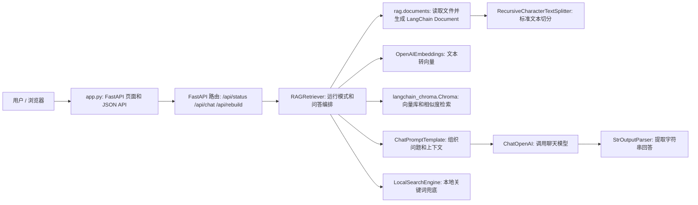
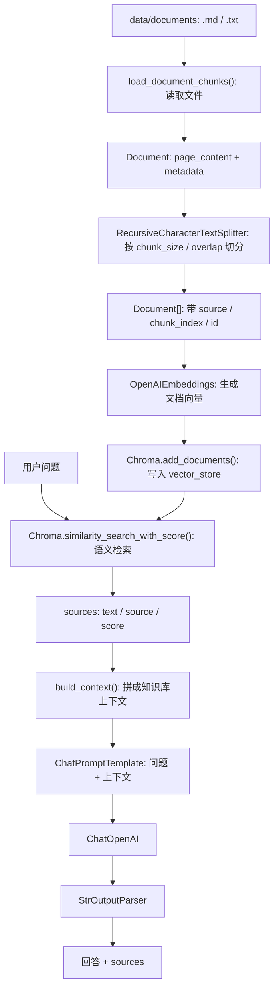
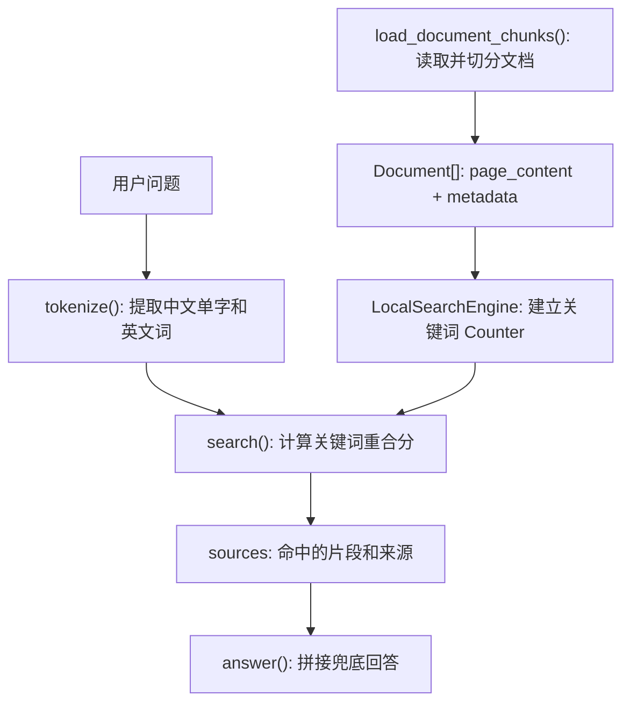

# RAG ChatBot LangChain 项目解析

> 本文解释改造后的标准 LangChain RAG 架构。旧版 `RAG_ChatBot_项目解析.md` 记录的是手写轻量 RAG 实现，可作为对照阅读。

## 0. 改造结论

当前项目已经从“手写 RAG 编排”改造成“LangChain 标准 RAG”：

```text
文档读取 -> LangChain Document -> RecursiveCharacterTextSplitter
-> OpenAIEmbeddings -> LangChain Chroma -> Retriever/Search
-> ChatPromptTemplate -> ChatOpenAI -> StrOutputParser -> answer
```

保留不变的部分：

- Web 页面和 HTTP API 仍由 `app.py` 提供，服务器层已经迁移为 FastAPI。
- `.env` 配置项仍使用原来的 `LLM_*`、`EMBEDDING_*`、`CHUNK_*`、`TOP_K`。
- 未配置外部 API 时，仍保留本地关键词检索兜底模式。
- `vector_store/` 仍是 ChromaDB 本地持久化目录，并继续被 `.gitignore` 忽略。

## 1. 新架构总览



模块对应关系：

| 项目模块 | LangChain 组件 | 职责 |
| --- | --- | --- |
| `rag/documents.py` | `Document`、`RecursiveCharacterTextSplitter` | 读取 `.md/.txt`，切成带 metadata 的文档片段 |
| `rag/embeddings.py` | `OpenAIEmbeddings` | 使用 OpenAI-compatible Embedding API 生成向量 |
| `rag/vector_store.py` | `Chroma` | 持久化文档片段、metadata 和 embedding，并执行相似度检索 |
| `rag/retriever.py` | `ChatPromptTemplate | ChatOpenAI | StrOutputParser` | 把检索结果组织成 prompt 并生成回答 |
| `rag/local_search.py` | 无 LangChain 检索组件 | 保留无 API 时的关键词兜底 |

## 2. 完整 RAG 数据流



改造后的核心变化：

- 文档片段不再是自定义 `DocumentChunk`，而是 LangChain `Document`。
- 切分器不再是自写 `split_text()`，而是 `RecursiveCharacterTextSplitter`。
- 向量库不再直接操作 ChromaDB collection，而是通过 `langchain_chroma.Chroma`。
- LLM 调用不再直接使用 OpenAI SDK，而是通过 LangChain runnable chain。

## 3. 文档切分

`rag/documents.py` 现在返回 LangChain `Document`：

```text
Document(
  page_content="片段正文",
  metadata={
    "id": "guide.md:0:xxxx",
    "source": "guide.md",
    "chunk_index": 0,
    "start_index": ...
  }
)
```

切分策略使用：

```python
RecursiveCharacterTextSplitter(
    chunk_size=CHUNK_SIZE,
    chunk_overlap=CHUNK_OVERLAP,
    separators=["\n\n", "\n", "。", ". ", " ", ""],
    add_start_index=True,
)
```

这些 separators 保留了原项目的中文友好策略：优先按段落、换行、中文句号、英文句号切分，最后才退到空格和字符级切分。

`metadata["id"]` 仍由 `stable_chunk_id(source, index, text)` 生成，供 Chroma 写入时作为稳定 id 使用。

### 3.1 chunk 参数怎么调

当前默认值仍是：

```env
CHUNK_SIZE=900
CHUNK_OVERLAP=120
TOP_K=3
MAX_CONTEXT_CHARS=6000
```

这组参数适合中文说明文档：一个 chunk 大致容纳一小节或几个自然段，overlap 保留段落边界附近的上下文，`TOP_K=3` 又能让 3 个片段大概率放进 `MAX_CONTEXT_CHARS`。

调参时先看 `sources`，不要只看最终回答：

| 现象 | 常见原因 | 调整方向 |
| --- | --- | --- |
| 命中的片段只有零散句子，答案不完整 | chunk 太小或 overlap 太小 | 增大 `CHUNK_SIZE` 或 `CHUNK_OVERLAP` |
| 命中的片段很长，但大部分和问题无关 | chunk 太大 | 减小 `CHUNK_SIZE` |
| 多个命中片段内容高度重复 | overlap 太大或 `TOP_K` 太高 | 减小 `CHUNK_OVERLAP` 或 `TOP_K` |
| context 被截断，后续来源进不去 prompt | `TOP_K * CHUNK_SIZE` 超过上下文上限 | 降低 `TOP_K`、减小 `CHUNK_SIZE` 或增大 `MAX_CONTEXT_CHARS` |

每次调整 `CHUNK_SIZE` 或 `CHUNK_OVERLAP` 后都要重建索引，因为 chunk 内容变化会导致 embedding 和 Chroma 中的 id 都变化。

## 4. 向量库与检索

`rag/vector_store.py` 现在封装的是 LangChain `Chroma`：

```text
VectorStore.upsert_documents()
-> Chroma.add_documents(documents, ids)

VectorStore.query()
-> Chroma.similarity_search_with_score(query, k=TOP_K)
```

Chroma 中保存：

| 内容 | 来源 | 用途 |
| --- | --- | --- |
| id | `Document.metadata["id"]` | 稳定写入和删除 |
| page_content | `Document.page_content` | 命中后给 LLM 做上下文 |
| metadata | `Document.metadata` | 前端展示来源 |
| embedding | `OpenAIEmbeddings` | 语义相似度检索 |

`rag/embeddings.py` 创建 `OpenAIEmbeddings` 时会设置 `check_embedding_ctx_length=False`。这是为了兼容 DashScope 等 OpenAI-compatible 服务：LangChain 默认可能把长文本转成 token 数组再提交，而部分兼容接口只接受字符串或字符串列表。当前项目的 chunk 已经由 `CHUNK_SIZE` 控制长度，因此这里选择直接提交原始字符串。

`query()` 会把 `Document + distance` 转成前端和上下文构建器都能理解的 `sources`：

```json
{
  "source": "rag_chatbot_guide.md",
  "chunk_index": 0,
  "text": "片段正文",
  "score": 0.91
}
```

这里的 `score` 仍是 `1 - distance` 的简化展示值，只适合本次查询内相对比较。

## 5. 生成链路

`rag/retriever.py` 中的完整 RAG 生成链路变成 LangChain runnable：

```text
ChatPromptTemplate
| ChatOpenAI
| StrOutputParser
```

执行时：

```text
query -> Chroma 检索 -> sources -> build_context()
-> {"query": query, "context": context}
-> rag_chain.invoke()
-> answer
```

Prompt 仍保持原项目约束：

- 只能基于给定知识库上下文回答。
- 上下文不足时明确说明不知道。
- 回答简洁、准确，并尽量引用来源名称。

## 6. 本地兜底模式

本地兜底模式仍保留，但它现在读取的是 LangChain `Document`：

```text
Document.page_content -> tokenize -> Counter -> 关键词打分 -> sources
```

流程图：



它和完整 RAG 的区别：

| 对比点 | 本地兜底 | 完整 LangChain RAG |
| --- | --- | --- |
| Embedding API | 不调用 | 调用 `OpenAIEmbeddings` |
| Chroma | 不使用 | 使用 `langchain_chroma.Chroma` |
| LLM API | 不调用 | 使用 `ChatOpenAI` |
| 检索依据 | 字面关键词重合 | 语义向量相似度 |
| 回答方式 | 程序拼接命中片段 | 模型基于上下文生成 |

这让项目在 `.env` 未配置完整时仍能演示文档读取、简单检索和来源展示。

## 7. 运行与维护入口

| 任务 | 入口 |
| --- | --- |
| 调整切分大小 | `.env` 的 `CHUNK_SIZE`、`CHUNK_OVERLAP` |
| 调整检索数量 | `.env` 的 `TOP_K` |
| 调整上下文上限 | `.env` 的 `MAX_CONTEXT_CHARS` |
| 更换 LLM | `.env` 的 `LLM_BASE_URL`、`LLM_MODEL` |
| 更换 Embedding | `.env` 的 `EMBEDDING_BASE_URL`、`EMBEDDING_MODEL` |
| 重建索引 | 页面按钮 `重建知识库索引` 或 `POST /api/rebuild` |
| 清空向量库 | 删除 `vector_store/` 后重新启动或重建 |
| 查看 API 文档 | FastAPI 自动文档 `/docs` 或 `/redoc` |

服务仍通过 `python app.py` 启动；`main()` 读取 `HOST` 和 `PORT` 后交给 Uvicorn 运行 FastAPI 应用。前端页面的 `fetch("/api/...")` 调用保持不变。

重建索引时，`RAGRetriever.rebuild_index()` 会重新执行：

```text
load_document_chunks()
-> LocalSearchEngine(chunks)
-> VectorStore.reset()
-> VectorStore.upsert_documents(chunks)
```

本地兜底模式只会重新读取文档和重建关键词索引，不会调用 Embedding、Chroma 或 LLM。

## 8. 与 LangGraph 的关系

本次没有引入 LangGraph，因为当前项目是标准“检索 -> 生成”的 RAG，不需要图状态机。

LangGraph 更适合这些增强场景：

- 判断是否需要检索。
- 检索前改写用户问题。
- 对检索到的文档打分。
- 文档不相关时重新检索。
- 多轮 agent 工具调用。

当前项目如果未来要升级为 Agentic RAG，可以把 `RAGRetriever` 中的流程拆成 LangGraph 节点：`retrieve -> grade -> rewrite -> generate`。

## 9. 测试覆盖

测试已对应 LangChain 架构更新：

| 测试文件 | 覆盖点 |
| --- | --- |
| `tests/test_documents.py` | LangChain splitter、Document metadata、稳定 id |
| `tests/test_vector_store.py` | Chroma 写入、查询、清空、collection 恢复 |
| `tests/test_context_builder.py` | Document + score 转上下文、长度截断 |
| `tests/test_retriever.py` | LangChain RAG chain mock、本地兜底 Document 支持 |

常用验证命令：

```powershell
python -m compileall app.py rag tests
python -m unittest discover -s tests
```

## 10. 常见问题

| 问题 | 优先检查 |
| --- | --- |
| 页面一直显示本地兜底模式 | `.env` 是否完整配置 `LLM_*` 和 `EMBEDDING_*`，是否还保留模板占位值 |
| Embedding 报模型不支持 | `EMBEDDING_MODEL` 是否误填了聊天模型 |
| `vector_count` 为 0 | 是否有 `.md/.txt` 文档，完整 RAG 是否初始化成功，是否已经重建索引 |
| 修改文档后答案没变化 | 是否点击了重建索引，或者是否仍连着旧服务进程 |
| sources 命中不准 | 先看 chunk 是否过大/过小，再看 Embedding 模型、`TOP_K` 和知识库内容 |
| Chroma collection 报不存在 | 停止其他 FastAPI 服务进程，只保留一个服务使用同一个 `vector_store/` |

## 11. 官方参考

- LangChain RAG 教程：https://docs.langchain.com/oss/python/langchain/rag
- LangGraph Agentic RAG 教程：https://docs.langchain.com/oss/python/langgraph/agentic-rag
- LangChain Chroma 参考：https://reference.langchain.com/python/langchain-chroma/vectorstores/Chroma

## 12. 一句话总结

改造后，项目仍保持原来的 Web/API 使用体验，服务器层由 FastAPI 提供，RAG 内核已经迁移到 LangChain 标准组件：`Document` 负责知识片段，`RecursiveCharacterTextSplitter` 负责切分，`OpenAIEmbeddings` 负责向量化，`Chroma` 负责检索，`ChatPromptTemplate | ChatOpenAI | StrOutputParser` 负责生成回答。
