# RAG ChatBot 项目解析

> 面向新接手项目的开发者：先建立整体心智模型，再按模块理解代码，最后串起完整 RAG 模式、本地兜底模式、接口、测试与排障。

> Mermaid 查看说明：在 VS Code 里，Mermaid 不会在源码编辑区直接变成图。请安装 Mermaid 预览插件后，使用 `Ctrl+Shift+V` 打开 Markdown Preview，或右键选择 `Open Preview to the Side`。本文中的 Mermaid 图已改成更兼容的纯 Mermaid 标签，避免使用 HTML 换行标签这类可能被插件拦截的写法。

## 0. 先说结论

这个项目是一个轻量级中文 RAG 问答助手。它没有使用 LangChain、LangGraph 或 LangSmith，而是用项目内模块手写了一条清晰的 RAG 编排链路：

```text
文档加载/切片 -> Embedding -> ChromaDB -> 检索 -> 上下文构建 -> LLM -> Web/API 展示
```

如果 `.env` 没有完整配置 LLM 与 Embedding 服务，项目不会直接失败，而是自动进入本地关键词检索兜底模式。这个设计让项目即使没有外部 API，也能演示“读取知识库、检索片段、展示来源”的基本体验。

推荐阅读顺序：

1. 先看整体架构图和一次问答流程。
2. 再看 `RAGRetriever` 如何在完整 RAG 和本地兜底之间切换。
3. 深入 `documents.py` 的 chunking，因为它决定知识库进入检索系统的最小单位。
4. 最后看配置、API、测试和常见排障。

## 1. 当前整体架构

项目入口是 `app.py`。它使用 Python 标准库 `http.server` 提供网页和 JSON API，然后把真正的问答工作交给 `rag/retriever.py` 中的 `RAGRetriever`。

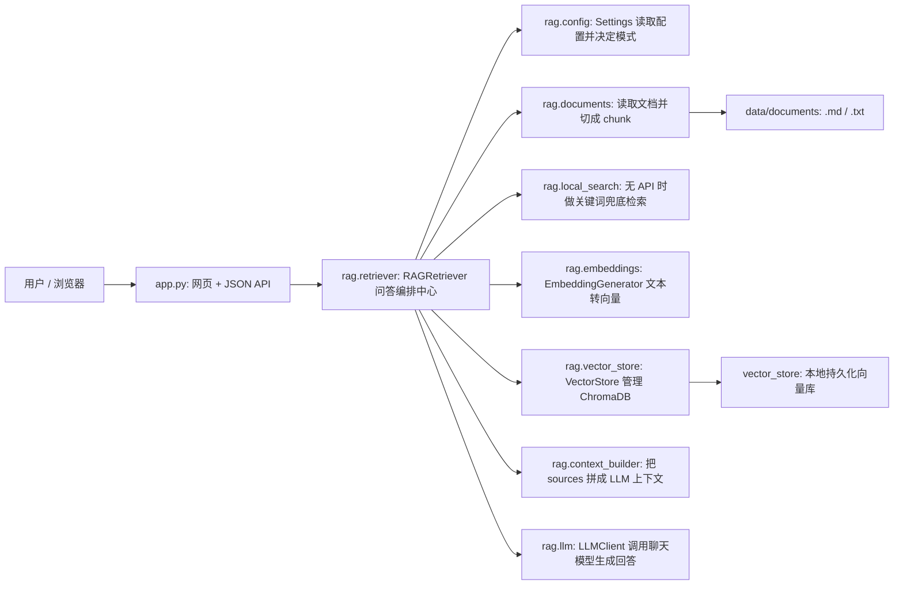

核心目录可以这样理解：

| 路径 | 角色 | 你应该重点看什么 |
| --- | --- | --- |
| `app.py` | Web 服务入口 | 路由、状态接口、聊天接口、重建索引入口 |
| `rag/config.py` | 配置层 | `.env` 读取、模板占位值过滤、完整 RAG 配置判断 |
| `rag/documents.py` | 知识库输入层 | 读取 `.md`/`.txt`、切片、稳定 chunk id |
| `rag/embeddings.py` | 向量生成层 | OpenAI-compatible Embedding API 调用 |
| `rag/vector_store.py` | 向量库层 | ChromaDB 持久化、写入、查询、重置 |
| `rag/local_search.py` | 本地兜底检索层 | token 化、关键词打分、无 API 时返回来源 |
| `rag/context_builder.py` | Prompt 上下文层 | 把检索结果压缩成 LLM 可读上下文 |
| `rag/llm.py` | LLM 调用层 | OpenAI-compatible Chat Completions API |
| `rag/retriever.py` | 编排层 | 串起所有模块，决定走完整 RAG 还是兜底 |
| `tests/` | 回归测试 | chunking、上下文截断、向量库、RAG 编排 |

## 2. 一次对话背后发生了什么

用户在网页输入问题后，前端会请求 `POST /api/chat`。`app.py` 解析 JSON，取出 `message`，调用全局 `retriever.answer(message)`。

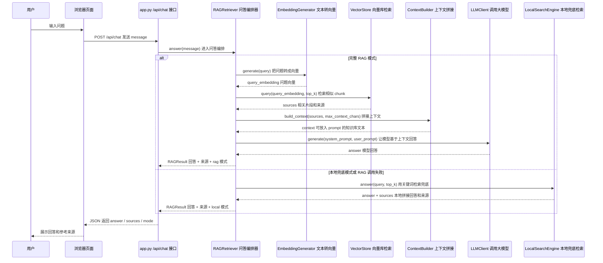

有两个关键点：

- 完整 RAG 模式需要 `.env` 同时具备 `LLM_*` 和 `EMBEDDING_*` 配置。
- 即使完整 RAG 运行中异常，`RAGRetriever.answer()` 也会捕获异常并临时退回本地关键词检索，避免用户界面直接崩掉。

## 3. 两种运行模式

### 3.1 完整 RAG 模式

完整 RAG 模式用于真实语义检索和模型生成。启动时或点击“重建知识库索引”时，会读取知识库文档、生成向量并写入 ChromaDB。

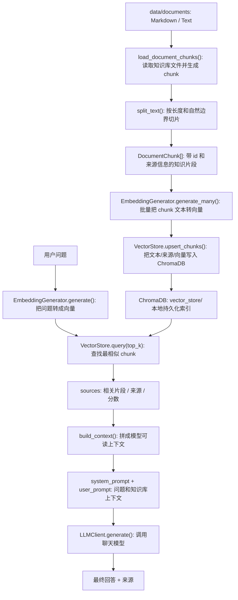

完整 RAG 的价值在于：

- 文档片段和用户问题都被转换为向量，能做语义相似度检索。
- 检索结果会带上 `source`、`chunk_index`、`score` 和原文片段。
- LLM 收到的是“问题 + 检索到的知识库上下文”，而不是凭空回答。

### 3.2 本地兜底模式

本地兜底模式不调用外部 API，也不依赖 ChromaDB 向量检索。它主要用于演示和排障：即使 API key 没配好，也可以看到文档读取、片段检索和来源展示。

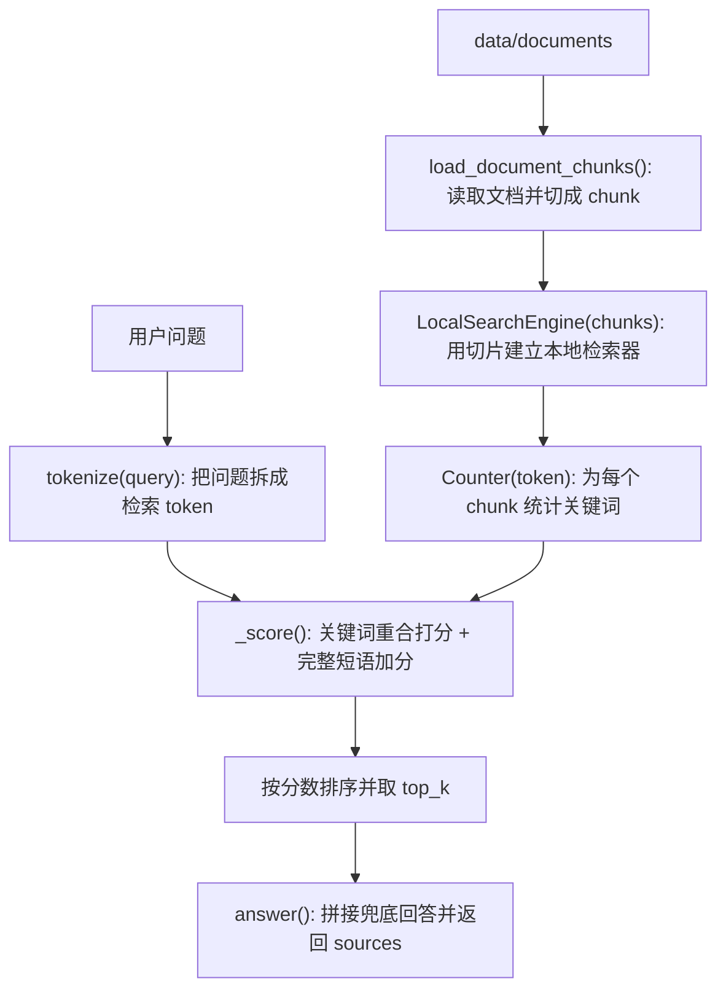

本地兜底模式不是完整 RAG。它不会调用 LLM，也不会做语义向量检索；回答文本由 `LocalSearchEngine.answer()` 根据最相关片段直接拼接出来。

## 4. 与 LangChain / LangGraph 的关系

本项目没有使用 LangChain、LangGraph 或 LangSmith。依赖文件 `requirements.txt`、`environment.yml` 和源码中都没有相关引用。

当前项目采用的是“手写轻量 RAG 编排”。也就是说，框架里常见的 loader、splitter、retriever、chain、graph node 等职责，都由项目自己的模块承担。

| 框架中常见概念 | 如果用 LangChain/LangGraph 通常是什么 | 本项目对应实现 |
| --- | --- | --- |
| Document Loader | 读取文件并生成 Document | `load_document_chunks()` 扫描 `data/documents` |
| Text Splitter | 把长文档拆成片段 | `split_text()` 和 `_find_soft_boundary()` |
| Embeddings | 把文本转成向量 | `EmbeddingGenerator` 直接调用 OpenAI-compatible API |
| VectorStore | 存储和查询向量 | `VectorStore` 直接封装 ChromaDB |
| Retriever | 按问题找相关文档 | `VectorStore.query()` + `RAGRetriever._answer_with_rag()` |
| Chain / LCEL | 串起检索、Prompt、LLM | `RAGRetriever.answer()` 手写流程控制 |
| Graph Node / StateGraph | 多节点状态流转 | 当前没有图编排，逻辑集中在 `RAGRetriever` |
| Tracing / LangSmith | 调用链追踪 | 当前只使用 `logging` 写日志 |

这样做的好处是项目结构更透明，适合学习 RAG 基本原理。代价是少了一些框架提供的高级能力，例如复杂多步 agent、链路追踪、可视化调试和可插拔组件生态。

如果未来要引入 LangGraph，可以优先把 `RAGRetriever` 拆成几个节点：

```text
load_or_refresh_documents -> retrieve_sources -> build_context -> call_llm -> format_response
```

但在当前项目规模下，手写编排已经足够清楚。

## 5. 模块详解

### 5.1 `app.py`：Web 页面和 API 入口

`app.py` 是项目的“外壳层”。它不负责具体检索算法，也不直接调用 Embedding 或 LLM；它负责把浏览器请求变成 `RAGRetriever` 能处理的函数调用，再把结果转成 JSON 或页面内容返回给用户。

可以把它理解成三层：

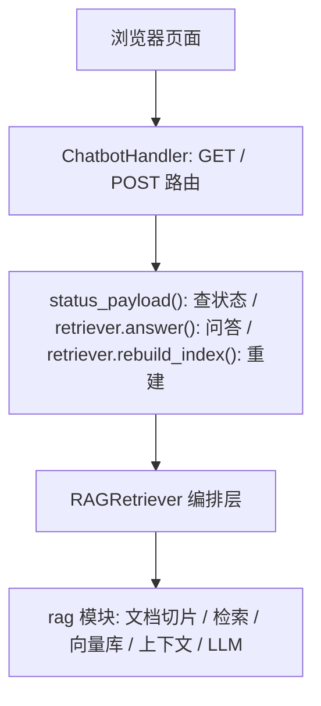

启动时先执行三行关键初始化：

```python
settings = Settings.from_env()
configure_logging(settings.log_file)
retriever = RAGRetriever(settings)
```

这三行决定了整个服务的运行状态：

| 初始化对象 | 作用 |
| --- | --- |
| `Settings` | 从 `.env` 读取配置，判断是否具备完整 RAG 条件 |
| `configure_logging()` | 设置文件日志和控制台日志 |
| `RAGRetriever` | 加载文档，并根据配置进入完整 RAG 或本地兜底模式 |

主要接口：

| 方法 | 路径 | 作用 |
| --- | --- | --- |
| `GET` | `/` | 返回内置 HTML 页面 |
| `GET` | `/api/status` | 返回运行模式、切片数、向量数、组件状态、启动警告 |
| `POST` | `/api/chat` | 接收用户问题并返回回答、来源和模式 |
| `POST` | `/api/rebuild` | 重新读取知识库；完整 RAG 模式下还会重建向量索引 |

三个接口各自很薄：`/api/chat` 读取 `message` 后调用 `retriever.answer()`；`/api/status` 通过 `status_payload()` 汇总模式、切片数、向量数、组件状态和 warning；`/api/rebuild` 只调用 `retriever.rebuild_index()`。前端页面也内置在 `HTML_PAGE` 中，用原生 JavaScript 调这些接口，不引入额外前端框架。

理解 `app.py` 时要注意边界：它是 HTTP 和页面层，不应该把 chunking、embedding、向量检索、prompt 拼接等逻辑塞进来；这些都应该留在 `rag/` 模块中。

### 5.2 `rag/config.py`：配置层

`rag/config.py` 是项目的配置入口。它把 `.env`、默认值、路径解析和“是否能进入完整 RAG 模式”的判断集中到 `Settings` 里，避免其他模块到处直接读环境变量。

核心对象是不可变的 `Settings` dataclass。配置在启动时确定，避免运行过程中被不同模块随意改动。

关键配置分三类：

| 类型 | 配置项 |
| --- | --- |
| LLM | `LLM_API_KEY`、`LLM_BASE_URL`、`LLM_MODEL` |
| Embedding | `EMBEDDING_API_KEY`、`EMBEDDING_BASE_URL`、`EMBEDDING_MODEL` |
| RAG 参数 | `DOCUMENTS_DIR`、`VECTOR_STORE_DIR`、`VECTOR_COLLECTION_NAME`、`TOP_K`、`CHUNK_SIZE`、`CHUNK_OVERLAP`、`MAX_CONTEXT_CHARS` |

配置加载流程：

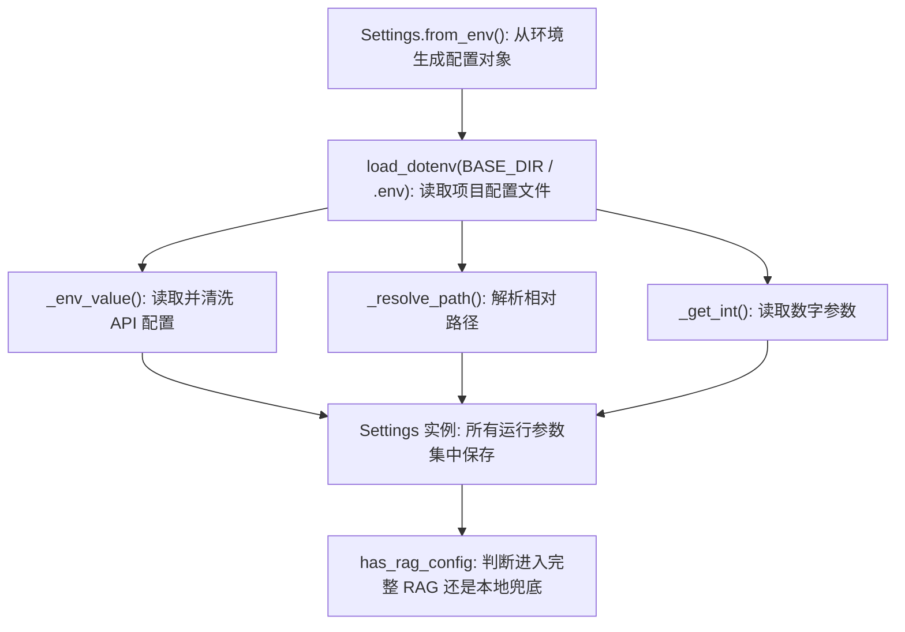

这里最重要的设计是 `_env_value()` 会过滤模板占位值。比如 `your_llm_api_key`、`your-chat-model`、`https://api.example.com/v1` 不会被当作有效配置。

因此，判断是否进入完整 RAG 模式不是看 `.env` 文件是否存在，而是看：

```text
has_rag_config = has_llm_config and has_embedding_config
```

只要任一必要配置缺失，`RAGRetriever` 就会进入本地兜底模式，并在状态栏显示缺失项。

路径配置也做了统一处理：`_resolve_path()` 会把相对路径转换成基于项目根目录的绝对路径。这样无论从哪个工作目录启动服务，项目都能找到正确的知识库和向量库目录。

`_get_int()` 则用于读取数字配置。如果 `.env` 里写了非法数字，它不会让程序启动失败，而是回退到默认值：

| 配置 | 默认值 | 影响 |
| --- | ---: | --- |
| `TOP_K` | 3 | 每次检索返回多少个片段 |
| `CHUNK_SIZE` | 900 | 每个 chunk 的目标最大长度 |
| `CHUNK_OVERLAP` | 120 | 相邻 chunk 的重叠长度 |
| `MAX_CONTEXT_CHARS` | 6000 | 传给 LLM 的最大上下文字符数 |

还兼容了旧配置名：

- `VECTOR_STORE_DIR` 优先；如果没有，则读 `CHROMA_PERSIST_DIR`。
- `VECTOR_COLLECTION_NAME` 优先；如果没有，则读 `CHROMA_COLLECTION_NAME`。

所以新接手项目时，如果页面一直显示“本地兜底模式”，应该优先看 `Settings.missing_rag_config` 对应的 warning，而不是先怀疑检索代码。

### 5.3 `rag/documents.py`：文档加载与 chunking

RAG 不是把整篇文档直接塞给模型，而是先把知识库拆成片段。这个项目的切片逻辑集中在 `rag/documents.py`。

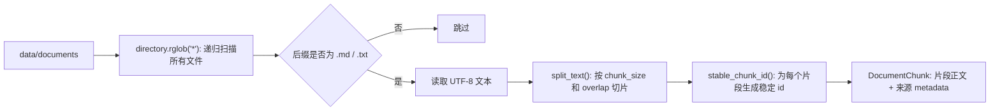

核心对象是 `DocumentChunk`：

| 字段 | 含义 |
| --- | --- |
| `id` | 稳定 chunk id，用于向量库 upsert |
| `text` | 当前片段的正文 |
| `metadata` | 元数据，目前包含 `source` 和 `chunk_index` |

文档加载规则：

- 递归读取：`directory.rglob("*")` 会扫描 `data/documents` 下所有层级。
- 格式过滤：只接受 `.md` 和 `.txt`。
- 空文档跳过：读取后 `strip()` 为空则不生成 chunk。
- 路径存储：`source` 使用相对 `documents_dir` 的路径，便于前端展示来源。

#### `split_text()` 的细节

`split_text()` 不是简单按固定字符数硬切，而是先找自然边界。

```text
hard_end = min(start + chunk_size, len(text))
soft_end = _find_soft_boundary(text, start, hard_end)
chunk = text[start:soft_end].strip()
start = max(soft_end - overlap, start + 1)
```

这里有三个概念：

| 概念 | 作用 |
| --- | --- |
| `chunk_size` | 每个片段的目标最大长度，默认 900 |
| `chunk_overlap` | 相邻片段共享的尾部上下文，默认 120 |
| `soft_end` | 比硬切更自然的停止位置 |

`_find_soft_boundary()` 会在 `start` 到 `hard_end` 的窗口里找四种边界：

1. 空行 `\n\n`
2. 换行 `\n`
3. 中文句号 `。`
4. 英文句号加空格 `. `

如果找到的位置太靠前，会退回 `hard_end`，避免切出过短片段。

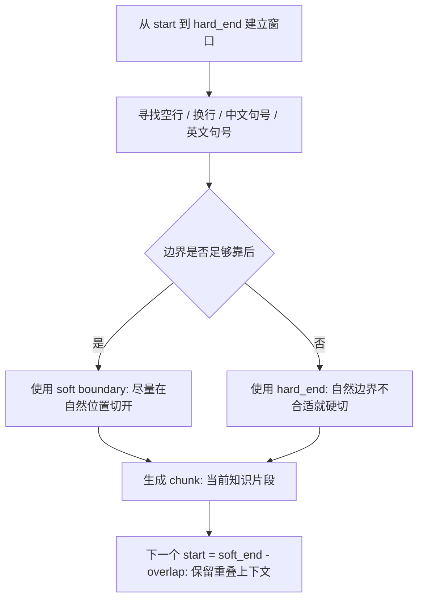

`overlap` 的目的，是让下一个 chunk 从上一个 chunk 尾部稍早的位置开始。假设某个概念横跨两个片段，overlap 能让后一个片段仍保留上一段结尾，降低检索时丢上下文的概率。

稳定 id 由 `stable_chunk_id(source, index, text)` 生成，内部使用 SHA1：

```text
source + chunk_index + chunk_text -> sha1 -> source:index:digest
```

文档路径、片段序号、片段内容任一变化，id 都会变化。这样 ChromaDB upsert 时能稳定识别同一批切片。

当前默认参数下，样本文档 `data/documents/rag_chatbot_guide.md` 会被切成 2 个 chunk，长度约为 869 和 177。这个结果说明默认的 `900/120` 更偏向保留段落语义，而不是制造大量很短片段。

为什么 chunking 很重要：

- chunk 太大：检索结果会包含太多无关内容，LLM 上下文被浪费。
- chunk 太小：片段缺少前后语义，可能只检索到零散句子。
- overlap 太小：跨片段概念容易断裂。
- overlap 太大：向量库冗余增多，检索结果可能重复。

#### 如何选择 `chunk_size` 和 `chunk_overlap`

这两个值不是自动算出来的，也没有固定官方最佳值。它们需要结合知识库文档形态、检索效果、`TOP_K` 和 `MAX_CONTEXT_CHARS` 一起调。

当前默认值：

```env
CHUNK_SIZE=900
CHUNK_OVERLAP=120
```

这是一个偏中文说明文档的经验折中：单个 chunk 足够容纳一小节或几个自然段，`120` 个字符的 overlap 又能覆盖边界处的上下文，同时不会制造太多重复片段。

经验范围可以先按文档类型选择：

| 文档类型 | 建议 `chunk_size` | 建议 `chunk_overlap` | 说明 |
| --- | ---: | ---: | --- |
| 普通中文说明文档 | 700-1000 | 80-150 | 适合当前项目这种教程、说明类文档 |
| FAQ / 短问答 | 300-600 | 50-100 | 问答本身较短，chunk 不宜过大 |
| 长技术文档 | 900-1500 | 120-250 | 需要保留更完整的章节语义 |
| 代码 / API 文档 | 不建议纯字符切 | 不建议纯字符切 | 更适合按标题、函数、类或结构化 splitter 切 |

一个实用的上限判断是：

```text
TOP_K * CHUNK_SIZE <= MAX_CONTEXT_CHARS 的一半到三分之二
```

例如当前默认值：

```text
TOP_K * CHUNK_SIZE = 3 * 900 = 2700
MAX_CONTEXT_CHARS = 6000
```

这说明检索到的 3 个 chunk 大概率能完整放进上下文，并且还留有来源标题、分隔符和 prompt 的空间。如果把 `CHUNK_SIZE` 调到 `2500`，`3 * 2500 = 7500`，就会超过 `MAX_CONTEXT_CHARS`，后面的内容会被截断或丢弃。

推荐调参流程：

1. 先用默认值 `900 / 120`。
2. 准备 10-20 个真实问题，最好覆盖项目介绍、配置、RAG 流程、排障等不同主题。
3. 每次只改一组参数，例如 `500 / 80`、`900 / 120`、`1200 / 180`。
4. 修改 `.env` 后重启服务，并点击“重建知识库索引”。
5. 观察每个问题返回的 `sources`：是否命中正确文档，chunk 是否包含完整答案，是否混入太多无关内容，top_k 结果是否高度重复。
6. 选择“正确来源命中率高、片段语义完整、无关内容少、重复片段少”的组合。

常见现象和调整方向：

| 现象 | 可能原因 | 调整方向 |
| --- | --- | --- |
| 回答经常不完整 | chunk 太小，或 overlap 太小 | 增大 `CHUNK_SIZE` 或 `CHUNK_OVERLAP` |
| 来源片段很长但只有一小部分相关 | chunk 太大 | 减小 `CHUNK_SIZE` |
| 多个 top_k 来源内容高度重复 | overlap 太大 | 减小 `CHUNK_OVERLAP` |
| 答案刚好跨两个片段，模型漏掉前后文 | overlap 太小 | 增大 `CHUNK_OVERLAP` |
| 检索结果整体不相关 | 未必是 chunk 问题 | 检查文档内容、问题表达、Embedding 模型和 `TOP_K` |

对当前项目来说，如果知识库仍然以中文 `.md/.txt` 说明文档为主，可以继续使用 `900 / 120`。如果以后文档变成长篇技术手册，可以试 `1200 / 180`；如果变成大量短 FAQ，可以试 `500 / 80`。

### 5.4 `rag/embeddings.py`：Embedding 调用

Embedding 的作用，是把“人能读懂的文本”转换成“向量数据库能比较相似度的数字数组”。

可以把它理解成：模型读完一段文字后，把这段文字在语义空间里的位置表示成一串浮点数。

```text
"如何扩展知识库？" -> [0.012, -0.083, 0.441, ...]
"把 .md 文件放入 data/documents 后重建索引" -> [0.018, -0.079, 0.452, ...]
```

如果两个文本语义接近，它们的向量方向通常也更接近。ChromaDB 后面做的“向量检索”，本质就是拿用户问题的向量去和文档 chunk 的向量做相似度比较。

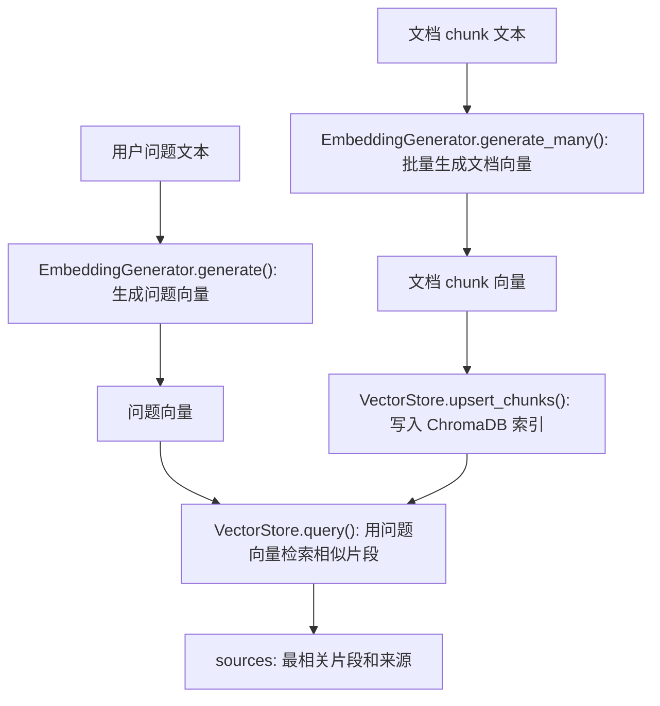

`EmbeddingGenerator` 是这个转换过程的封装。它没有使用 LangChain 的 Embeddings 抽象，而是直接使用 `openai.OpenAI` 客户端调用 OpenAI-compatible `/embeddings` 接口。

初始化时会创建 OpenAI SDK 客户端，并保存 `EMBEDDING_MODEL`。`api_key`、`base_url`、`model` 分别来自 `.env` 的 `EMBEDDING_API_KEY`、`EMBEDDING_BASE_URL`、`EMBEDDING_MODEL`，其中 base URL 会先经过 `normalize_openai_base_url()` 归一化。

这个类有两个对外方法：

| 方法 | 用在什么时候 | 输入 | 输出 |
| --- | --- | --- | --- |
| `generate(text)` | 用户每次提问时 | 单个问题字符串 | 单个向量 `list[float]` |
| `generate_many(texts, batch_size=64)` | 启动或重建索引时 | 多个 chunk 文本 | 多个向量 `list[list[float]]` |

两条链路分别是：

```text
重建索引：
DocumentChunk.text[] -> generate_many() -> embeddings[] -> VectorStore.upsert_chunks()

用户提问：
query -> generate() -> query_embedding -> VectorStore.query()
```

`generate(text)` 内部复用 `generate_many([text])`，避免单条和批量两套请求逻辑。`generate_many()` 默认 `batch_size=64`，意思是最多每 64 段文本发一次 embedding 请求；这比每个 chunk 单独请求更高效，也能避免一次请求塞入过多文本。

另一个重要细节是按 `item.index` 排序：

```python
ordered = sorted(response.data, key=lambda item: item.index)
embeddings.extend([item.embedding for item in ordered])
```

这样做是为了保证“输入文本顺序”和“输出向量顺序”严格一致。后面 `VectorStore.upsert_chunks(chunks, embeddings)` 会按列表位置把 chunk 和 embedding 配对；如果顺序错了，向量库里就会出现“文本 A 配了文本 B 的向量”的严重问题，检索结果会变得混乱。

这里最容易踩坑的是模型配置：`EMBEDDING_MODEL` 必须填写向量模型，不能填写聊天模型。比如 DashScope 场景下：

```env
LLM_MODEL="qwen3.6-plus"
EMBEDDING_MODEL="text-embedding-v4"
```

`LLM_MODEL` 用来生成回答，`EMBEDDING_MODEL` 用来生成向量。把聊天模型填到 `EMBEDDING_MODEL` 后，程序会调用 `/embeddings` 接口，但服务端会拒绝这个模型，常见报错类似：

```text
Unsupported model ... for OpenAI compatibility mode
```

所以判断 Embedding 是否工作正常，可以看三件事：

- `/api/status` 里 `embedding_model` 是否为“已就绪”。
- 完整 RAG 模式下 `vector_count` 是否大于 0。
- 提问时返回的 `sources` 是否和问题语义相关，而不是随机片段。

### 5.5 `rag/vector_store.py`：ChromaDB 向量库

`VectorStore` 负责把“文档 chunk 的向量”存进 ChromaDB，并在用户提问时按问题向量找回最相似的 chunk。

它不通过 LangChain 的 VectorStore 抽象，而是直接使用 `chromadb.PersistentClient`。这样项目里向量库的写入、查询和重建逻辑都能在一个文件里看清楚。

ChromaDB 里不是只存向量，而是同时保存：

| 存储内容 | 来自哪里 | 用途 |
| --- | --- | --- |
| `ids` | `chunk.id` | 唯一标识一个 chunk，支持 upsert 和 delete |
| `documents` | `chunk.text` | 查询命中后返回原文片段 |
| `metadatas` | `chunk.metadata` | 保存 `source`、`chunk_index` 等来源信息 |
| `embeddings` | Embedding API 返回的向量 | 用于相似度检索 |

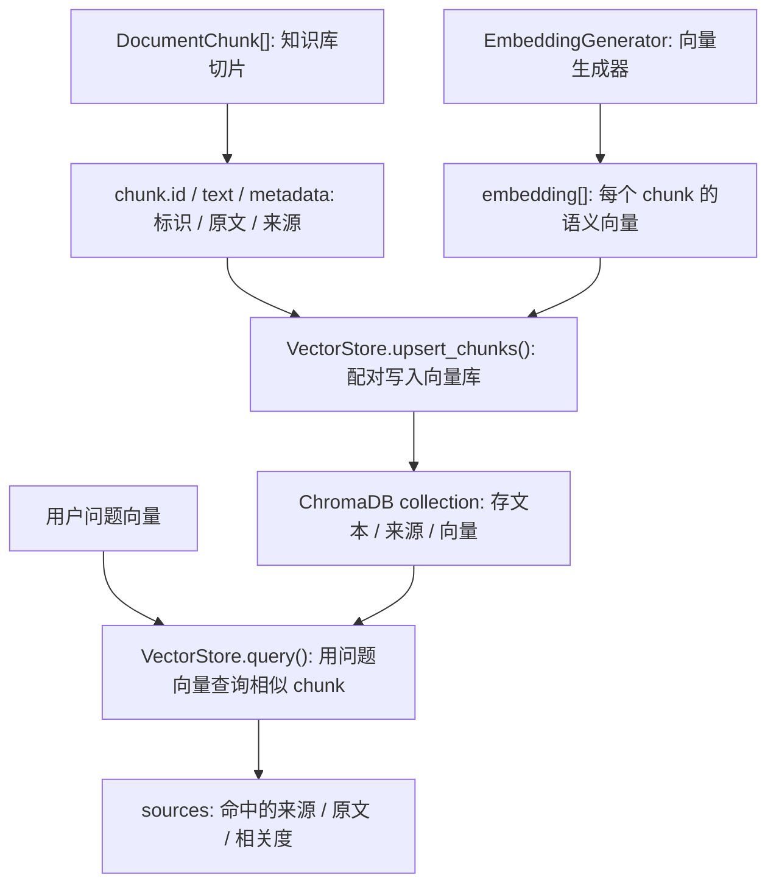

核心生命周期可以压缩成四步：

| 阶段 | 代码入口 | 具体做什么 |
| --- | --- | --- |
| 初始化 | `VectorStore(persist_dir, collection_name)` | 连接 `vector_store/`，获取或创建 `docs` collection |
| 写入 | `upsert_chunks(chunks, embeddings)` | 检查 chunk 和 embedding 数量一致，再把 id、文本、metadata、向量一起写入 |
| 查询 | `query(query_embedding, top_k)` | 用问题向量查最相似的 chunk，并取回 `documents/metadatas/distances` |
| 重建 | `reset()` | 删除 collection 里的旧 ids，但保留 collection 本身 |

真正写入时，`upsert_chunks()` 会把 chunk 拆成 ChromaDB 需要的四组列表：

```python
self.collection.upsert(
    ids=[chunk.id for chunk in chunks],
    documents=[chunk.text for chunk in chunks],
    metadatas=[chunk.metadata for chunk in chunks],
    embeddings=embeddings,
)
```

这里使用 `upsert` 而不是单纯 `add`：id 不存在就新增，id 已存在就更新。它和 `stable_chunk_id()` 配合后，可以让同一批 chunk 在重建索引时保持可识别。

#### 查询：`query()`

用户提问时，流程是：

```text
query 文本 -> EmbeddingGenerator.generate() -> query_embedding -> VectorStore.query()
```

`query()` 会先判断 collection 是否为空；如果有数据，再请求 ChromaDB：

```python
results = self.collection.query(
    query_embeddings=[query_embedding],
    n_results=max(1, top_k),
    include=["documents", "metadatas", "distances"],
)
```

这里 `include` 的三个字段很关键：

| 字段 | 为什么要取 |
| --- | --- |
| `documents` | 命中的原文片段，要给 LLM 构建上下文 |
| `metadatas` | 命中的来源信息，要给前端展示 |
| `distances` | 与问题向量的距离，要转换成相关度分数 |

ChromaDB 返回的数据是按 query 分组的嵌套列表。本项目每次只查一个问题向量，所以 `_first()` 取第一组结果，然后整理成统一的 `sources`：

```json
{
  "source": "rag_chatbot_guide.md",
  "chunk_index": 0,
  "text": "片段正文",
  "score": 0.91
}
```

`sources` 会继续流向两个地方：`context_builder.py` 用它拼 LLM 上下文，`app.py` 前端用它展示“参考来源”。

#### 分数：distance 到 score

ChromaDB 返回的是 `distance`，不是“分数越高越相关”的 score。当前项目为了让前端更好理解，把距离转换成 0 到 1 的相关度：

```python
score = round(max(0.0, min(1.0, 1.0 - float(distance))), 3)
```

`distance` 越小，`score` 越接近 1，代表越相关。这个 score 主要用于展示和同一次查询内的相对比较，不要把它理解成跨模型、跨知识库都通用的绝对置信度。

`reset()` 只删除 collection 里的旧 ids，不删除 collection 本身。这样可以减少多进程或旧引用导致的 `Collection [...] does not exist` 问题。代码仍然会在 `count()`、`reset()`、`upsert_chunks()`、`query()` 遇到 collection 丢失时尝试重新获取 collection，但更稳妥的做法仍然是同一时间只运行一个 `python app.py` 使用同一个 `vector_store/`。

核心方法总结：

| 方法 | 作用 |
| --- | --- |
| `count()` | 返回 collection 中向量数量 |
| `reset()` | 删除当前 collection 内已有文档，不删除 collection 本身 |
| `upsert_chunks()` | 写入 chunk 文本、metadata 和 embedding |
| `query()` | 根据问题向量查询 top_k 相关片段 |
| `close()` | 如果底层 client 支持 close，则关闭连接 |

### 5.6 `rag/local_search.py`：本地关键词检索

这一节最容易混淆：**本地关键词检索和完整 RAG 都使用同一批 `DocumentChunk`，但它们使用 chunk 的方式完全不同。**

`chunk` 只是知识库被切开后的基础单位。后面走哪条路线，取决于当前运行模式：

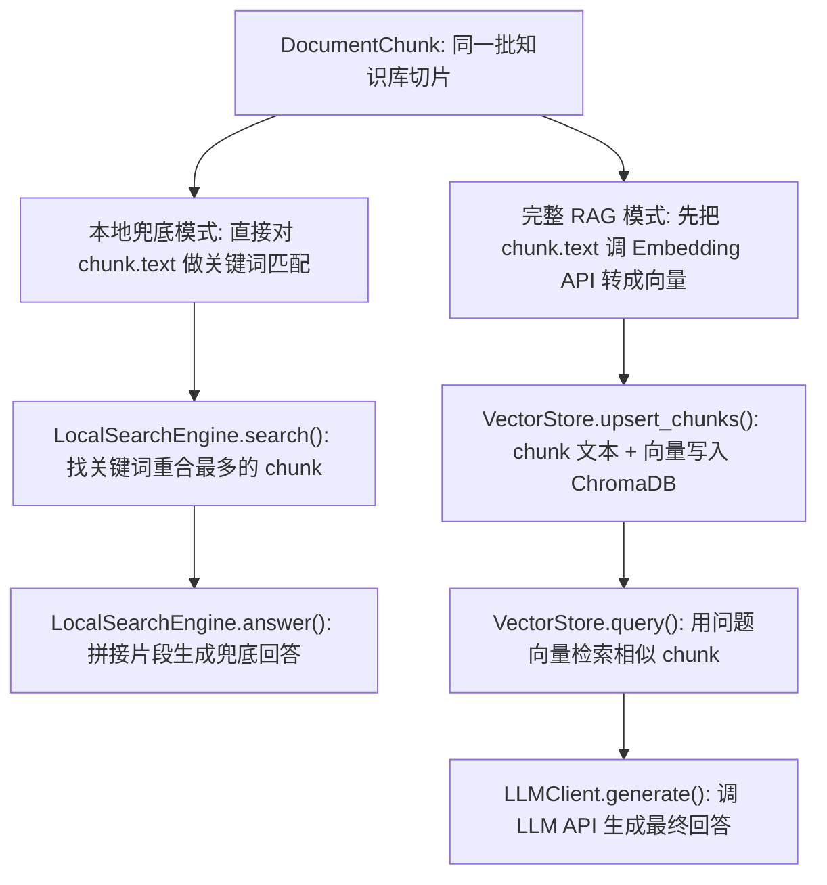

区别不是“有没有 chunk”，而是“chunk 后续怎么被使用”：

| 对比点 | 本地关键词检索 `local_search.py` | 完整 RAG API 调用 |
| --- | --- | --- |
| 是否使用 chunk | 使用同一批 `DocumentChunk` | 使用同一批 `DocumentChunk` |
| chunk 怎么参与检索 | 直接对 `chunk.text` 做关键词匹配 | 先把 `chunk.text` 调 Embedding API 转成向量 |
| 是否调用 Embedding API | 不调用 | 调用 `/embeddings` |
| 是否使用 ChromaDB | 不使用 | 使用 ChromaDB 存储和检索向量 |
| 是否调用 LLM API | 不调用 | 调用 `/chat/completions` |
| 检索依据 | 字面关键词重合 | 向量语义相似度 |
| 回答来源 | 程序把命中的 chunk 摘要拼起来 | LLM 基于检索上下文生成自然答案 |
| 适用场景 | 没配 API、演示、排障 | 正常 RAG 问答 |

例如用户问“怎么扩展知识库？”。本地关键词检索主要看问题和 chunk 里是否有“知识库”等字面 token 重合；完整 RAG 会把问题和 chunk 都转成向量，让 Embedding 模型判断“扩展知识库”和“把 .md 文件放入 data/documents 后重建索引”是否语义接近。

因此，本地关键词检索是“字面匹配”，完整 RAG 是“语义检索 + 模型生成”。

`LocalSearchEngine` 的目标不是替代完整 RAG，而是在没有完整配置 LLM 与 Embedding API 时，仍然让项目完成三件事：

1. 读取知识库文档。
2. 根据关键词找出相对相关的 chunk。
3. 在页面上展示兜底回答和参考来源。

它不调用外部模型，也不使用 ChromaDB。所有检索都在内存中完成，流程是：`chunk.text -> tokenize -> Counter -> 打分排序 -> sources -> 兜底回答`。

本地模式拿到的是 `RAGRetriever._load_documents()` 生成的 `DocumentChunk` 列表：

```python
self.chunks = load_document_chunks(...)
self.local_engine = LocalSearchEngine(self.chunks)
```

它主要使用两个字段：`chunk.text` 用来做关键词匹配和拼接兜底回答，`chunk.metadata` 用来返回 `source` 和 `chunk_index`。这里没有 embedding，也没有向量库。

token 规则是：

```text
[a-zA-Z0-9_]+|[\u4e00-\u9fff]
```

英文、数字、下划线会组成词；中文按单字切分。

`LocalSearchEngine` 初始化时会为每个 chunk 建一个 `Counter(token)`。查询时对用户问题也做同样 token 化，然后计算重合程度。

初始化时会提前为每个 chunk 建立 `Counter(token)`，所以每次查询时不需要重新扫描所有 chunk 文本，只需要拿已经建好的 `chunk_terms` 来打分。

查询阶段是纯本地计算：

```text
query -> tokenize -> Counter -> 对每个 chunk 打分 -> 排序 -> 格式化 sources
```

打分由两部分组成：

| 部分 | 作用 |
| --- | --- |
| token overlap | 问题 token 与 chunk token 的重合度 |
| phrase_bonus | 如果完整问题字符串出现在 chunk 中，额外加分 |

`token overlap` 还加入了轻量 TF 权重；`phrase_bonus` 则处理“完整问题直接出现在文档里”的情况。

如果完全没有匹配结果，`search()` 会返回前 `top_k` 个 chunk，保证页面仍能展示来源，而不是空白。

最后 `_format_results()` 会把原始分数归一化：

```text
score = 当前 chunk 原始分 / 本次查询最高原始分
```

所以本地模式里的 `score` 只表示“本次关键词检索内的相对相关度”，不能和 ChromaDB 的向量 score 混用成同一种绝对指标。

`answer()` 会把 sources 的前 260 个字符拼成兜底回答，并明确提示“当前没有完整配置 LLM 与 Embedding API”。这不是 LLM 生成的自然答案，而是程序基于命中片段拼出来的参考内容。

本地关键词检索会在两种情况下使用：

1. 启动时配置不完整：缺少任意 `LLM_*` 或 `EMBEDDING_*`。
2. 完整 RAG 已启用，但某次调用失败：例如 Embedding API 报错、ChromaDB 查询异常、LLM 返回异常。

第二种情况发生时，`RAGRetriever.answer()` 会捕获异常并临时调用 `local_engine.answer(query, top_k)`。因此，本地检索既是没配 API 时的演示模式，也是完整 RAG 运行失败时的保护逻辑。

无论是本地关键词检索，还是 ChromaDB 向量检索，最后都会返回类似结构：

```json
{
  "source": "rag_chatbot_guide.md",
  "chunk_index": 0,
  "text": "片段正文",
  "score": 1.0
}
```

这是为了让 `app.py` 前端用同一套代码展示“参考来源”。但本地模式的 `score` 来自关键词打分归一化，完整 RAG 的 `score` 来自 ChromaDB distance 转换，结构相同不代表含义完全相同。

### 5.7 `rag/context_builder.py`：上下文构建

`build_context()` 接在向量检索之后、LLM 调用之前。它解决的问题是：`VectorStore.query()` 返回的是结构化 `sources`，但 `LLMClient.generate()` 需要的是一段能直接放进 prompt 的文本。

完整 RAG 的这一段链路是：

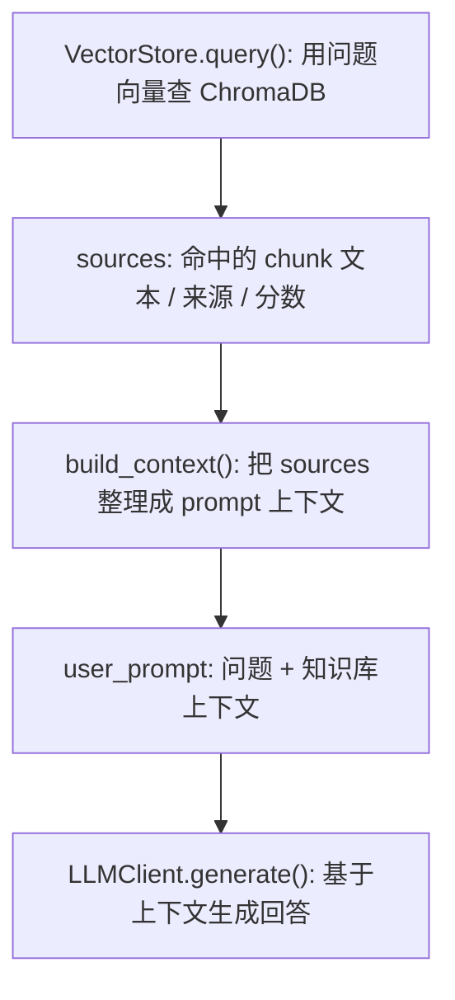

所以它和前面的向量化关系很直接：

1. `EmbeddingGenerator.generate(query)` 把用户问题转成问题向量。
2. `VectorStore.query(query_embedding, top_k)` 用问题向量找到相似 chunk。
3. `build_context(sources, max_chars)` 把这些相似 chunk 整理成 LLM 可读上下文。
4. `LLMClient.generate()` 才能基于这段上下文回答。

输入的 `sources` 来自向量检索结果，结构类似：

```json
[
  {
    "source": "guide.md",
    "score": 0.92,
    "text": "RAG 包含检索和生成两个关键步骤。"
  }
]
```

这些字段不是随便放进去的：

| 字段 | 从哪里来 | 在上下文中的作用 |
| --- | --- | --- |
| `source` | ChromaDB metadata | 告诉模型和前端片段来自哪个文档 |
| `score` | ChromaDB distance 转换 | 提示哪个片段相对更相关 |
| `text` | ChromaDB document | 真正提供给 LLM 的知识内容 |

`build_context()` 会把它们变成这种文本：

```text
[1] source=guide.md, score=0.92
RAG 包含检索和生成两个关键步骤。

[2] source=faq.md, score=0.81
...
```

然后 `RAGRetriever._answer_with_rag()` 把它放进 `user_prompt`：

```text
问题：{query}

知识库上下文：
{context}
```

也就是说，LLM 看到的不是 ChromaDB 的原始返回值，而是 `build_context()` 整理后的“带来源的知识库文本”。

它还会遵守 `MAX_CONTEXT_CHARS`，防止把过长上下文塞给 LLM：

- 如果上下文还没超过限制，就继续追加片段。
- 如果当前片段太长，会截断正文并添加 `[truncated]`。
- 如果剩余空间太少，直接停止追加。

截断逻辑里有一个细节：

```python
available_text_chars = remaining - len(header) - 14
if available_text_chars < 120:
    break
```

如果剩余空间连 120 个正文字符都放不下，就不再追加这个片段。这样可以避免上下文里出现只有标题、几乎没有正文的无效来源。

这个长度控制和向量检索参数是联动的：

```text
TOP_K 决定最多取多少个 sources
CHUNK_SIZE 决定每个 source 大概多长
MAX_CONTEXT_CHARS 决定最终能放进 prompt 的上下文上限
```

如果 `TOP_K * CHUNK_SIZE` 远大于 `MAX_CONTEXT_CHARS`，后面的片段就可能被截断或直接丢弃。所以它不是孤立模块，而是把“向量检索结果”变成“LLM 可消费上下文”的最后一道闸门。

`max_chars <= 0` 时，代码不会执行长度限制，会尽量拼接所有 sources。当前默认配置 `MAX_CONTEXT_CHARS=6000`，正常运行时会限制上下文长度。

### 5.8 `rag/llm.py`：LLM 调用

`LLMClient` 是最终生成回答的封装。它和 `EmbeddingGenerator` 一样，直接使用 `openai.OpenAI` 客户端，不经过 LangChain。

它只做一件事：把 `system_prompt` 和 `user_prompt` 发给 OpenAI-compatible Chat Completions 接口，并返回模型生成的文本。

`generate(system_prompt, user_prompt)` 调用 Chat Completions：

```text
model = LLM_MODEL
temperature = 0.2
messages = [
  system prompt,
  user prompt
]
```

在完整 RAG 模式里，两个 prompt 来自 `RAGRetriever._answer_with_rag()`：

| Prompt | 内容 | 目的 |
| --- | --- | --- |
| `system_prompt` | “你是严谨的中文 RAG 问答助手，只能基于上下文回答...” | 约束回答边界，降低幻觉 |
| `user_prompt` | 用户问题 + `build_context()` 生成的知识库上下文 | 给模型提供问题和可用资料 |

`temperature=0.2` 表示回答偏稳定、保守。RAG 问答通常不需要太高随机性，因为重点是准确复述和归纳知识库内容。

`generate()` 会检查返回内容：

```python
content = response.choices[0].message.content
if isinstance(content, str) and content.strip():
    return content.strip()
raise RuntimeError("LLM response did not contain generated text.")
```

也就是说，如果服务端响应成功但没有有效文本，项目会主动抛错。这个异常会被 `RAGRetriever.answer()` 捕获，并临时退回本地兜底模式。

`normalize_openai_base_url()` 会处理常见错误输入：

- 如果 base URL 以 `/chat/completions`、`/embeddings` 或 `/responses` 结尾，会先去掉这些接口路径。
- 如果没有以 `/v1` 结尾，会自动补上 `/v1`。
- 如果不是合法 http(s) URL，会抛出错误。

这样用户可以在 `.env` 里填写：

```env
LLM_BASE_URL="https://dashscope.aliyuncs.com/compatible-mode"
```

也可以填写：

```env
LLM_BASE_URL="https://dashscope.aliyuncs.com/compatible-mode/v1"
```

程序最终都会归一化成 OpenAI SDK 需要的 base URL。

这里要区分 `LLMClient` 和 `EmbeddingGenerator`：

| 模块 | 调用接口 | 模型类型 | 用途 |
| --- | --- | --- | --- |
| `LLMClient` | `/chat/completions` | 聊天模型 | 根据上下文生成最终回答 |
| `EmbeddingGenerator` | `/embeddings` | 向量模型 | 把问题和 chunk 转成向量 |

两个模型不能混用。

### 5.9 `rag/retriever.py`：项目的编排中心

`RAGRetriever` 是最重要的模块。它不是单纯的“检索器”，而是项目里的 RAG runtime controller。

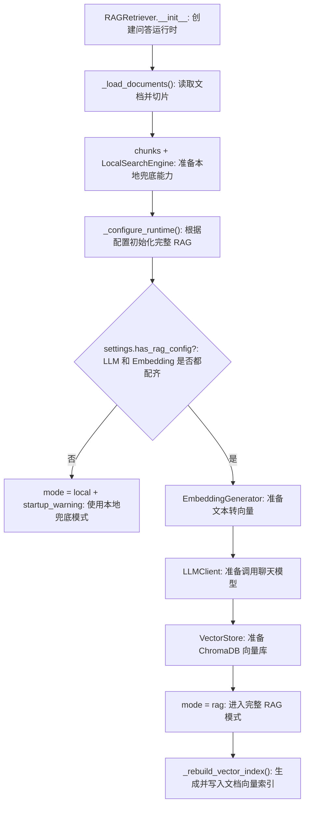

关键属性：

| 属性 | 含义 |
| --- | --- |
| `mode` | `"rag"` 或 `"local"` |
| `startup_warning` | 启动时配置缺失或初始化失败的提示 |
| `chunks` | 当前知识库切片 |
| `local_engine` | 本地关键词检索引擎 |
| `embedding_generator` | 完整 RAG 模式下的向量生成器 |
| `llm_client` | 完整 RAG 模式下的 LLM 客户端 |
| `vector_store` | 完整 RAG 模式下的 ChromaDB 封装 |

可以按生命周期理解 `RAGRetriever`。

#### 启动阶段

启动时先调用 `_load_documents()`：

```text
读取 data/documents -> split_text -> self.chunks -> LocalSearchEngine
```

注意：无论是否有外部 API，都会先构建 `LocalSearchEngine`。这是兜底能力的基础。

然后调用 `_configure_runtime()`：

```text
如果缺少 LLM_* 或 EMBEDDING_*：
    保持 mode = "local"
    写入 startup_warning

如果配置完整：
    初始化 EmbeddingGenerator
    初始化 LLMClient
    初始化 VectorStore
    mode = "rag"
    _rebuild_vector_index()
```

所以完整 RAG 模式不是只看配置，还要能成功初始化外部客户端和 ChromaDB，并完成首次向量索引构建。

#### 问答阶段

`answer(query)` 的控制逻辑：

```text
if mode == "rag":
    try:
        return _answer_with_rag(query)
    except:
        return local_engine.answer(query)
else:
    return local_engine.answer(query)
```

完整 RAG 链路 `_answer_with_rag(query)` 具体做四步：

```text
1. query -> embedding_generator.generate(query)
2. query_embedding -> vector_store.query(query_embedding, top_k)
3. sources -> build_context(sources, max_context_chars)
4. system_prompt + user_prompt -> llm_client.generate()
```

如果任一步失败，`answer()` 会记录异常，并临时调用 `local_engine.answer()`。返回给用户的回答会明确包含“完整 RAG 链路调用失败，已临时切换到本地关键词检索兜底模式”和错误摘要。

这个设计让用户请求不会因为一次外部 API 波动直接失败，但也不会隐藏错误。

#### 重建阶段

`rebuild_index()` 的控制逻辑：

```text
_load_documents()
if mode == "rag":
    _rebuild_vector_index()
```

所以点击页面上的“重建知识库索引”时：

- 本地兜底模式：重新读取文档并更新关键词检索内容。
- 完整 RAG 模式：重新读取文档，清空 ChromaDB collection 内文档，重新生成 embeddings 并 upsert。

`_rebuild_vector_index()` 里还有一个空知识库保护：

```python
if not self.chunks:
    self.startup_warning = "知识库暂无文档..."
    return
```

也就是说，如果 `data/documents/` 里没有可读 `.md` 或 `.txt`，项目不会去调用 embedding API，而是直接给出 warning。

理解这个模块时，最重要的是记住：`RAGRetriever` 是项目的状态机。`mode`、`startup_warning`、`chunks`、`local_engine`、`vector_store` 这些状态共同决定了页面展示和问答行为。

### 5.10 `rag/logging_config.py`：日志

`logging_config.py` 虽然很小，但它决定了运行时错误能不能被追踪。

`configure_logging(log_file)` 同时配置：

- 文件日志：默认 `logs/app.log`
- 控制台日志：方便开发时观察

核心配置：

```python
logging.basicConfig(
    level=logging.INFO,
    format="%(asctime)s [%(levelname)s] %(name)s - %(message)s",
    handlers=[
        logging.FileHandler(log_file, encoding="utf-8"),
        logging.StreamHandler(),
    ],
    force=True,
)
```

几个细节：

- `log_file.parent.mkdir(parents=True, exist_ok=True)` 会自动创建 `logs/` 目录。
- `FileHandler(..., encoding="utf-8")` 确保中文错误信息能正确写入文件。
- `StreamHandler()` 让开发时能在终端看到日志。
- `force=True` 会覆盖已有 logging 配置，避免重复 handler 或配置不生效。

当前主要由 `RAGRetriever` 写异常日志：

- 完整 RAG 初始化失败：记录 `Failed to initialize full RAG runtime.`
- 完整 RAG 问答失败：记录 `Full RAG pipeline failed; falling back to local mode.`

用户在页面上看到的是简化后的 warning 或错误摘要；开发者排查时应该看 `logs/app.log`，那里有完整 exception stack trace。

## 6. 关键数据结构和接口

这里不再展开完整 JSON 示例，只保留维护时最常用的字段和入口。

| 类型 / 接口 | 位置 | 关键内容 | 作用 |
| --- | --- | --- | --- |
| `DocumentChunk` | `rag/documents.py` | `id`、`text`、`metadata.source`、`metadata.chunk_index` | 知识库进入系统后的最小单位 |
| `RAGResult` | `rag/retriever.py` | `answer`、`sources`、`mode` | `RAGRetriever.answer()` 返回给 `app.py` 的统一结果 |
| `GET /api/status` | `app.py` | `mode`、`chunk_count`、`vector_count`、`components`、`warning` | 前端侧边栏展示运行状态 |
| `POST /api/chat` | `app.py` | 请求字段 `message`，响应字段 `answer/sources/mode` | 主问答入口 |
| `POST /api/rebuild` | `app.py` | 无请求体，返回当前状态或错误 | 重新读取文档；完整 RAG 模式下重建向量索引 |

## 7. 常见维护入口

| 想做什么 | 改哪里 | 改完要做什么 |
| --- | --- | --- |
| 添加知识库 | 放入 `.md` / `.txt` 到 `data/documents/` | 点击“重建知识库索引”或重启服务 |
| 配完整 RAG | `.env` 中填写 `LLM_*` 和 `EMBEDDING_*` | 重启服务；确认不是模板占位值 |
| 调整切片 | `.env` 的 `CHUNK_SIZE`、`CHUNK_OVERLAP` | 重建索引，因为 chunk 和 embedding 都会变化 |
| 调整检索数量 | `.env` 的 `TOP_K` | 重启服务；本地和完整 RAG 都受影响 |
| 控制 LLM 上下文 | `.env` 的 `MAX_CONTEXT_CHARS` | 重启服务；过大增加成本，过小可能丢信息 |
| 清理本地向量库 | 删除 `vector_store/` | 完整 RAG 模式下重新生成索引 |

`vector_store/` 是 ChromaDB 运行产物，已经在 `.gitignore` 中忽略，不应该提交。

## 8. 常见问题与排查

| 现象 | 优先检查 |
| --- | --- |
| 页面显示“本地兜底模式” | `.env` 是否缺少 `LLM_*` / `EMBEDDING_*`，是否仍是模板值，修改后是否重启 |
| Embedding 接口报模型不支持 | `EMBEDDING_MODEL` 是否误填了聊天模型 |
| `Collection [...] does not exist` | 是否多个 `python app.py` 进程同时使用同一个 `vector_store/` |
| `vector_count` 为 0 | 是否处于本地模式，是否有文档，是否已经重建索引，Embedding 是否成功 |
| 回答引用片段不相关 | 先看 `sources`，再检查 chunk 参数、知识库内容、Embedding 模型和 `TOP_K` |

## 9. 测试如何覆盖项目

当前测试集中在核心逻辑，而不是浏览器界面。

| 测试文件 | 覆盖点 |
| --- | --- |
| `tests/test_documents.py` | stable chunk id 是否可重复；切片是否产生 overlap |
| `tests/test_context_builder.py` | 上下文是否包含来源和分数；是否遵守 `max_chars` |
| `tests/test_vector_store.py` | ChromaDB upsert、query、reset；collection 丢失后的恢复 |
| `tests/test_retriever.py` | 使用 mock 组件验证 RAG 编排是否把来源放进 prompt |

常用验证命令：

```powershell
python -m compileall app.py rag tests
python -m unittest discover -s tests
```

## 10. 新人最该抓住的三条线

### 10.1 数据线

```text
data/documents -> DocumentChunk -> embedding -> ChromaDB -> sources -> context -> answer
```

这是完整 RAG 模式的数据流。

### 10.2 控制线

```text
app.py -> RAGRetriever.answer() -> _answer_with_rag() 或 LocalSearchEngine.answer()
```

这是用户提问后的控制流。

### 10.3 配置线

```text
.env -> Settings -> has_rag_config -> mode = "rag" 或 "local"
```

这是项目决定运行模式的逻辑。

## 11. 一句话总结

这个项目的核心不是某个框架，而是把 RAG 最关键的职责拆成了几个小而清楚的模块：`DocumentChunk` 是知识单位，`VectorStore` 和 `LocalSearchEngine` 是两种找知识的方式，`RAGRetriever` 是把知识、上下文和模型串起来的控制中心。
